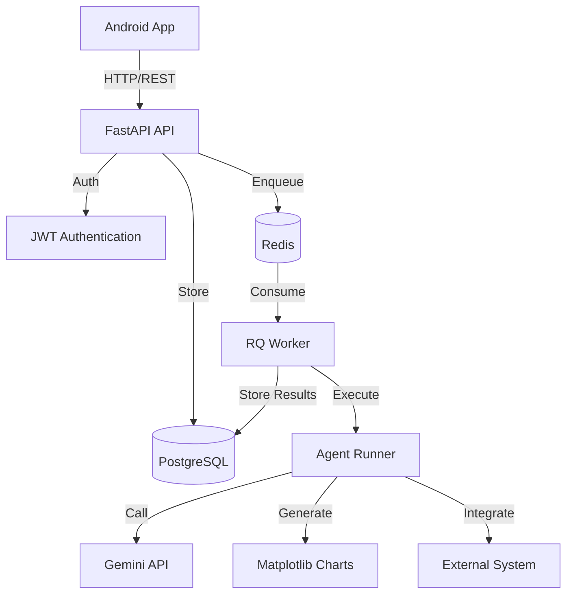

# LangGraph Chat Backend

Backend API for an Android-first chat application with asynchronous LangGraph agent execution.

## 🏗️ Architecture



## 🚀 Features

- **Async Message Processing**: Messages are accepted immediately (202 Accepted), processed asynchronously
- **Background Jobs**: Redis + RQ for reliable job processing
- **Agent Execution**: Gemini API integration (structured for future LangGraph replacement)
- **Visualization**: Automatic chart generation triggered by "plot:" or "chart:" keywords
- **External Integration**: HTTP integration with exponential backoff retries
- **Structured Logging**: JSON logs with correlation IDs (conversation_id, run_id, message_id)
- **Simple Auth**: JWT-based authentication with email/password
- **Media Serving**: Local filesystem storage for generated images

## 📋 Prerequisites

- Docker & Docker Compose
- (Optional) Gemini API key for AI responses
- (Optional) External integration URL

## 🛠️ Setup

### 1. Clone & Navigate
```bash
cd "e:\Work\personal projects\personal-assistant"
```

### 2. Configure Environment
```bash
# Copy example env file
cp .env.example .env

# Edit .env and set your values (especially GEMINI_API_KEY if you have one)
notepad .env
```

**Important Environment Variables:**
- `GEMINI_API_KEY`: Your Gemini API key (optional, will echo back if not set)
- `INTEGRATION_URL`: External system URL (optional, integration skipped if empty)
- `JWT_SECRET`: Change this in production!

### 3. Start Services
```bash
# Build and start all services (PostgreSQL, Redis, API, Worker)
docker-compose up --build
```

Wait for logs showing:
- ✅ PostgreSQL: `database system is ready to accept connections`
- ✅ Redis: `Ready to accept connections`
- ✅ API: `Application startup complete`
- ✅ Worker: `RQ worker listening on 'default' queue`

### 4. Find Your VM IP (for VM access)

**On your VM**, run:
```powershell
# Get VM IP address
ipconfig
# Look for "IPv4 Address" on your network adapter
```

## 📡 API Endpoints

Base URL: `http://<VM_IP>:8000` (or `http://localhost:8000` if running locally)

### Authentication

**Register:**
```bash
curl -X POST http://<VM_IP>:8000/v1/auth/register \
  -H "Content-Type: application/json" \
  -d "{\"email\":\"user@example.com\",\"password\":\"password123\"}"
```

Response:
```json
{
  "access_token": "eyJ0eXAiOiJKV1QiLCJhbGc...",
  "token_type": "bearer",
  "user_id": "123e4567-e89b-12d3-a456-426614174000"
}
```

**Login:**
```bash
curl -X POST http://<VM_IP>:8000/v1/auth/login \
  -H "Content-Type: application/json" \
  -d "{\"email\":\"user@example.com\",\"password\":\"password123\"}"
```

**💡 Save your token for subsequent requests!**

### Conversations

**Create Conversation:**
```bash
curl -X POST http://<VM_IP>:8000/v1/conversations \
  -H "Authorization: Bearer YOUR_TOKEN_HERE" \
  -H "Content-Type: application/json" \
  -d "{\"title\":\"My First Chat\"}"
```

Response:
```json
{
  "id": "conv-uuid",
  "user_id": "user-uuid",
  "title": "My First Chat",
  "created_at": "2026-01-31T12:00:00"
}
```

### Messages

**Post Message (triggers agent):**
```bash
curl -X POST http://<VM_IP>:8000/v1/conversations/CONV_ID/messages \
  -H "Authorization: Bearer YOUR_TOKEN_HERE" \
  -H "Content-Type: application/json" \
  -d "{\"text\":\"Hello! Can you help me?\"}"
```

Response (202 Accepted):
```json
{
  "message_id": "msg-uuid",
  "run_id": "run-uuid",
  "status": "queued"
}
```

**Post Message with Visualization:**
```bash
curl -X POST http://<VM_IP>:8000/v1/conversations/CONV_ID/messages \
  -H "Authorization: Bearer YOUR_TOKEN_HERE" \
  -H "Content-Type: application/json" \
  -d "{\"text\":\"plot: Show me a sample chart\"}"
```

**Poll Messages:**
```bash
# Get all messages
curl http://<VM_IP>:8000/v1/conversations/CONV_ID/messages \
  -H "Authorization: Bearer YOUR_TOKEN_HERE"

# Get messages after a specific message
curl "http://<VM_IP>:8000/v1/conversations/CONV_ID/messages?after_id=MSG_ID" \
  -H "Authorization: Bearer YOUR_TOKEN_HERE"

# Get messages since timestamp
curl "http://<VM_IP>:8000/v1/conversations/CONV_ID/messages?since=2026-01-31T12:00:00" \
  -H "Authorization: Bearer YOUR_TOKEN_HERE"
```

### Run Status

**Check Agent Run Status:**
```bash
curl http://<VM_IP>:8000/v1/runs/RUN_ID \
  -H "Authorization: Bearer YOUR_TOKEN_HERE"
```

Response:
```json
{
  "id": "run-uuid",
  "conversation_id": "conv-uuid",
  "trigger_message_id": "msg-uuid",
  "status": "succeeded",
  "started_at": "2026-01-31T12:00:01",
  "finished_at": "2026-01-31T12:00:03",
  "last_error": null,
  "created_at": "2026-01-31T12:00:00"
}
```

Status values: `queued`, `running`, `succeeded`, `failed`

### Media

**Get Generated Image:**
```bash
curl http://<VM_IP>:8000/v1/media/MEDIA_ID \
  -H "Authorization: Bearer YOUR_TOKEN_HERE" \
  --output chart.png
```

## 🔍 Health Check

```bash
curl http://<VM_IP>:8000/health
```

## 📊 Viewing Logs

```bash
# View all logs
docker-compose logs -f

# View API logs only
docker-compose logs -f api

# View worker logs only
docker-compose logs -f worker
```

## 🧪 Testing the Complete Flow

```bash
# On your VM, save this as test_flow.ps1 and run it
$VM_IP = "YOUR_VM_IP_HERE"
$BASE_URL = "http://${VM_IP}:8000"

# 1. Register
$response = Invoke-RestMethod -Uri "$BASE_URL/v1/auth/register" -Method Post -Body '{"email":"test@example.com","password":"test123"}' -ContentType "application/json"
$TOKEN = $response.access_token
Write-Host "Token: $TOKEN"

# 2. Create conversation
$conv = Invoke-RestMethod -Uri "$BASE_URL/v1/conversations" -Method Post -Headers @{Authorization="Bearer $TOKEN"} -Body '{"title":"Test"}' -ContentType "application/json"
$CONV_ID = $conv.id
Write-Host "Conversation ID: $CONV_ID"

# 3. Post message
$msg = Invoke-RestMethod -Uri "$BASE_URL/v1/conversations/$CONV_ID/messages" -Method Post -Headers @{Authorization="Bearer $TOKEN"} -Body '{"text":"plot: create a chart"}' -ContentType "application/json"
$RUN_ID = $msg.run_id
Write-Host "Run ID: $RUN_ID"

# 4. Wait and check status
Start-Sleep -Seconds 5
$run = Invoke-RestMethod -Uri "$BASE_URL/v1/runs/$RUN_ID" -Headers @{Authorization="Bearer $TOKEN"}
Write-Host "Status: $($run.status)"

# 5. Get messages
$messages = Invoke-RestMethod -Uri "$BASE_URL/v1/conversations/$CONV_ID/messages" -Headers @{Authorization="Bearer $TOKEN"}
Write-Host "Total messages: $($messages.Count)"
```

## 🗂️ Project Structure

```
personal-assistant/
├── app/
│   ├── main.py                 # FastAPI application
│   ├── core/
│   │   ├── config.py           # Pydantic settings
│   │   ├── logging.py          # Structured JSON logging
│   │   └── security.py         # JWT auth
│   ├── db/
│   │   ├── models.py           # SQLAlchemy models
│   │   └── session.py          # DB session management
│   ├── schemas/
│   │   ├── auth.py             # Auth schemas
│   │   ├── conversation.py     # Conversation schemas
│   │   ├── message.py          # Message schemas
│   │   └── run.py              # Run status schemas
│   ├── api/
│   │   └── routes/
│   │       ├── auth.py         # Auth endpoints
│   │       ├── conversations.py # Conversation endpoints
│   │       ├── messages.py     # Message endpoints
│   │       ├── runs.py         # Run status endpoints
│   │       └── media.py        # Media serving
│   ├── services/
│   │   ├── enqueue.py          # RQ job enqueue
│   │   ├── agent_runner.py     # Agent execution logic
│   │   ├── visuals.py          # Chart generation
│   │   └── integration.py      # External system calls
│   └── worker/
│       ├── worker.py           # RQ worker bootstrap
│       └── jobs.py             # Background job functions
├── data/
│   └── media/                  # Generated images
├── docker-compose.yml
├── Dockerfile
├── requirements.txt
└── README.md
```

## 🔧 Troubleshooting

### Cannot connect from Android device

1. **Check VM network**: Ensure VM is in bridged mode (not NAT)
2. **Firewall**: Allow port 8000 on VM firewall
   ```powershell
   New-NetFirewallRule -DisplayName "Chat API" -Direction Inbound -LocalPort 8000 -Protocol TCP -Action Allow
   ```
3. **Test from VM itself**: `curl http://localhost:8000/health`
4. **Test from device**: `curl http://<VM_IP>:8000/health`

### Worker not processing jobs

1. Check Redis connection: `docker-compose logs redis`
2. Check worker logs: `docker-compose logs worker`
3. Verify RQ queue: 
   ```bash
   docker-compose exec api python -c "from app.services.enqueue import job_queue; print(job_queue.count)"
   ```

### Database errors

1. Reset database:
   ```bash
   docker-compose down -v
   docker-compose up --build
   ```

### Gemini API not working

- Check `GEMINI_API_KEY` in `.env`
- System will fallback to echo if key is missing (not an error)

## 🚧 TODOs & Future Enhancements

### P1 (Next Priority)
- [ ] Rate limiting
- [ ] Automated tests for P0 flow
- [ ] Enhanced visual generation (parse user intent)

### P2 (Future)
- [ ] Replace Gemini with LangGraph
- [ ] SSE/WebSocket streaming for real-time updates
- [ ] Outbox pattern for reliable integration
- [ ] GCS storage migration
- [ ] Vector DB / pgvector for semantic search
- [ ] Firebase auth verification
- [ ] Advanced RBAC

## 📝 Notes

- **Auth**: Currently using simple JWT auth (email/password). Firebase auth is planned for P2.
- **Migrations**: Using `create_all()` for MVP. Alembic migrations can be added later.
- **LangGraph**: Agent runner is structured for easy LangGraph integration - just replace `_run_gemini_agent()`.
- **VM Access**: API binds to `0.0.0.0` and CORS allows all origins for easy VM-to-device access.

## 📄 License

MIT
